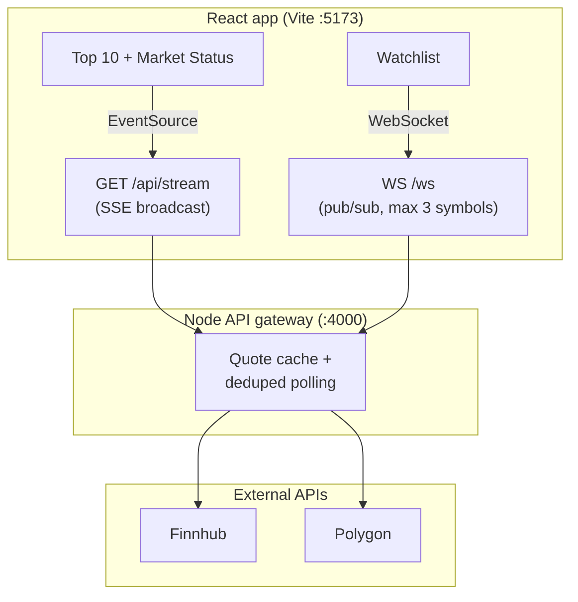

# Stock Tracker — Live Market Data App

A full-stack stock tracking application built as a thesis project. It demonstrates **real-time data delivery** using **Server-Sent Events (SSE)** and **WebSockets**, with a Node.js API gateway that caches quotes and deduplicates upstream API calls.

> Built with a focus on **manual QA**, edge-case validation, and clear separation between broadcast (SSE) and personalized (WebSocket) data flows.

---

## Features

| Area | What it does |
|------|----------------|
| **Top 10 stocks** | Live prices for AAPL, MSFT, GOOGL, AMZN, TSLA, NVDA, META, NFLX, INTC, CSCO via gateway SSE |
| **Market status** | Open/closed badge with reasons (weekend, outside hours, holiday) — Polygon API + ET timezone fallback |
| **Stock search** | Debounced symbol search (Finnhub) |
| **Stock detail** | Price, change, TradingView chart |
| **Watchlist** | Up to 3 symbols, persisted in `localStorage`, live quotes via gateway WebSocket pub/sub |
| **Price alerts** | Up to 3 alerts (above/below target), polled every 30s (Twelve Data) |
| **News ticker** | Market news feed |
| **Resilience** | WebSocket auto-reconnect with exponential backoff; SSE disconnect handling; local cache fallback for Top 10 |

---

## Tech stack

**Frontend**
- React 19 + Vite
- Tailwind CSS
- Chart.js / react-chartjs-2
- Custom hooks for watchlist, market status, and WebSocket streaming

**Backend (API gateway)**
- Node.js + Express 5
- `ws` WebSocket server
- SSE endpoint for broadcast snapshots

**External APIs**
- [Finnhub](https://finnhub.io/) — quotes & search
- [Polygon.io](https://polygon.io/) — market open/closed
- [Twelve Data](https://twelvedata.com/) — price alert polling
- [NewsAPI](https://newsapi.org/) — news ticker

---

## Architecture



### Why two real-time channels?

| Channel | Use case | Pattern |
|---------|----------|---------|
| **SSE** (`/api/stream`) | Same data for all users: market status + Top 10 | Server → many clients, one-way broadcast |
| **WebSocket** (`/ws`) | Per-user watchlist (up to 3 symbols) | Client subscribes; server pushes only those quotes |

The gateway **polls upstream once per symbol** (union of Top 10 + all WS subscriptions), then fans out to SSE and WebSocket clients — reducing rate-limit risk.

### Key design decisions

- **Node gateway** — hides API keys, centralizes caching, and coordinates SSE + WS from one process
- **React frontend** — component-based UI, hooks for streams, `localStorage` for watchlist/alerts
- **Market-closed guardrails** — no scheduled Finnhub polling when market is closed; WS subscribe skips upstream fetch when closed (serves cache only)

---

## Project structure

```
stocks_tracker/
├── server/
│   ├── index.js          # Express gateway: SSE, WebSocket, polling, cache
│   └── WEBSOCKET.md      # WebSocket protocol reference
├── src/
│   ├── components/       # UI (TopTen, Watchlist, StockDetail, …)
│   ├── hooks/            # useWatchlist, useMarketStatus, useWatchlistQuotesStream
│   ├── contexts/         # PricesContext (SSE), PriceAlertsContext
│   └── config/api.js     # API base URL + WebSocket URL helpers
└── .env.example
```

---

## Getting started

### Prerequisites

- Node.js 18+
- API keys (see `.env.example`)

### Setup

```bash
git clone https://github.com/YOUR_USERNAME/stocks_tracker.git
cd stocks_tracker
npm install
cp .env.example .env
# Add your API keys to .env
```

### Run (frontend + gateway)

```bash
npm run dev:all
```

| Service | URL |
|---------|-----|
| React app | http://localhost:5173 |
| API gateway | http://localhost:4000 |
| SSE stream | http://localhost:4000/api/stream |
| WebSocket | ws://localhost:4000/ws |
| Snapshot (REST) | http://localhost:4000/api/snapshot |

### Scripts

| Command | Description |
|---------|-------------|
| `npm run dev` | Vite frontend only |
| `npm run dev:server` | Gateway only |
| `npm run dev:all` | Both (recommended) |
| `npm run build` | Production build |
| `npm run lint` | ESLint |

### Environment variables

```env
FINNHUB_API_KEY=...          # or VITE_FINNHUB_API_KEY
POLYGON_API_KEY=...          # or VITE_POLYGON_API_KEY
VITE_TWELVE_DATA_KEY=...
VITE_NEWSAPI_KEY=...

# Optional
VITE_API_BASE_URL=http://localhost:4000
VITE_WS_URL=ws://localhost:4000/ws
PORT=4000
```

---

## Testing & QA

This project was validated through **structured manual testing** and **protocol-level checks**. Automated test coverage is planned as a next step.

### Test approach

1. **Functional testing** — core user flows end-to-end in the browser
2. **Integration testing** — frontend ↔ gateway ↔ external APIs
3. **Negative testing** — invalid inputs, missing server, market closed
4. **Observability** — Chrome DevTools (Network, Console), WebSocket frames, EventSource stream

### Manual test cases (executed)

| ID | Area | Steps | Expected | Result |
|----|------|-------|----------|--------|
| TC-01 | Startup | Run `npm run dev:all`, open app | Gateway on :4000, Vite on :5173, Top 10 loads | Pass |
| TC-02 | SSE | Wait for stream; compare UI to `/api/snapshot` | Top 10 + market status update via EventSource | Pass |
| TC-03 | Market status | View during open/closed hours | Correct badge and reason (weekend, hours, holiday) | Pass |
| TC-04 | Watchlist WS | Add symbol, open Watchlist | `hello` → `subscribe` → `subscribed` → `prices` | Pass |
| TC-05 | Boundary | Add 4th watchlist symbol | Blocked at max 3 symbols | Pass |
| TC-06 | Resilience | Stop/restart gateway | Watchlist reconnects; prices return | Pass |
| TC-07 | Negative WS | Send invalid JSON via `wscat` | Server returns `{ type: "error", ... }` | Pass |
| TC-08 | Market closed | Subscribe when market closed | No new upstream polls; cache or "—" shown | Pass |
| TC-09 | Search & routing | Search symbol, open detail, browser back | URL updates; navigation works | Pass |
| TC-10 | Cross-tab | Change watchlist in one tab | Other tab syncs via storage events | Pass |
| TC-11 | Lint | Run `npm run lint` | No blocking errors | Pass |

### Defects found during testing

| ID | Severity | Summary | Fix |
|----|----------|---------|-----|
| BUG-01 | High | Watchlist stuck on "connecting" when only Vite runs | Added `dev:all` + UI hint for port 4000 |
| BUG-02 | Medium | Redundant upstream API calls | Gateway dedupes symbols across all clients |
| BUG-03 | Low | Invalid WebSocket payload not handled gracefully | Server returns structured error message |

### Planned automated coverage

- **Vitest + React Testing Library** — hooks and components
- **Supertest** — `/api/stream`, `/api/snapshot`
- **WebSocket integration tests** — protocol per `server/WEBSOCKET.md`
- **CI** — lint + tests on pull request

---

## WebSocket protocol (summary)

See [`server/WEBSOCKET.md`](server/WEBSOCKET.md) for full details.

**Client → server**

```json
{ "type": "subscribe", "symbols": ["AAPL", "MSFT"] }
```

**Server → client**

```json
{ "type": "prices", "quotes": [...], "lastUpdatedAt": "..." }
```

---

## What I learned

- Writing **test cases from requirements** (symbol limits, market-closed rules, reconnect behavior)
- **Integration testing** across SSE, WebSocket, REST, and third-party APIs
- **Negative and boundary testing** with DevTools at the protocol layer
- Trade-offs between manual exploratory testing and automation in a time-boxed project

---

## License

MIT
