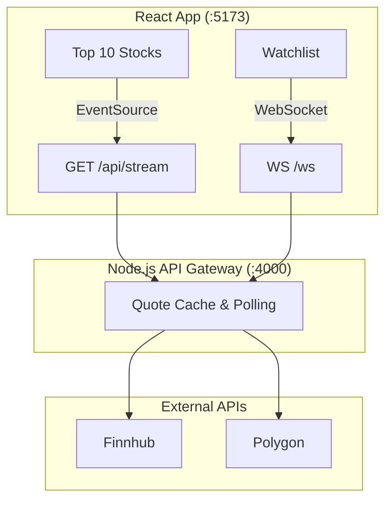

# Stock Tracker — Live Market Data App

A full-stack stock tracking application built as my Computer Science thesis project.

The application delivers live market data using **Server-Sent Events (SSE)** and **WebSockets** through a Node.js API gateway that caches stock quotes and minimizes unnecessary API requests.

---

## Features

| Area | Description |
|------|-------------|
| **Top 10 Stocks** | Displays live prices for AAPL, MSFT, GOOGL, AMZN, TSLA, NVDA, META, NFLX, INTC, and CSCO using SSE. |
| **Market Status** | Shows whether the U.S. market is open or closed, including reasons such as weekends, holidays, or outside trading hours. |
| **Stock Search** | Search for stocks with debounced requests to the Finnhub API. |
| **Stock Details** | View live prices, daily price changes, and interactive TradingView charts. |
| **Watchlist** | Save up to three stocks in local storage and receive live updates through WebSockets. |
| **Price Alerts** | Create price alerts that are checked every 30 seconds using Twelve Data. |
| **News Feed** | Displays the latest market news. |
| **Resilience** | Automatic WebSocket reconnection with exponential backoff and cached data fallback. |

---

## Tech Stack

### Frontend

- React 19
- Vite
- Tailwind CSS
- Chart.js
- React Context API
- Custom React Hooks

### Backend

- Node.js
- Express 5
- WebSockets (`ws`)
- Server-Sent Events (SSE)

### External APIs

- Finnhub
- Polygon.io
- Twelve Data
- NewsAPI

---

## Architecture



---

## Why use both SSE and WebSockets?

The application uses two real-time communication methods because they solve different problems.

| Technology | Purpose |
|------------|---------|
| **Server-Sent Events (SSE)** | Broadcasts the same market data (Top 10 stocks and market status) to every connected user. |
| **WebSockets** | Sends personalized updates for each user's watchlist. |

The gateway retrieves each stock quote only once, regardless of how many users are connected. It then distributes the data to both SSE clients and WebSocket subscribers, reducing API usage and helping stay within external rate limits.

---

## Design Decisions

- Built a Node.js API gateway to keep API keys secure and centralize communication with external services.
- Cached stock quotes to reduce duplicate requests and improve performance.
- Used Server-Sent Events for shared market data and WebSockets for user-specific watchlists.
- Stored watchlists and price alerts in local storage so they persist between sessions.
- Prevented unnecessary polling while the market is closed to reduce API usage.

---

## Project Structure

```
stocks_tracker/
├── server/
│   ├── index.js
│   └── WEBSOCKET.md
├── src/
│   ├── components/
│   ├── hooks/
│   ├── contexts/
│   └── config/
└── .env.example
```

---

## Getting Started

### Prerequisites

- Node.js 18+
- API keys for:
  - Finnhub
  - Polygon.io
  - Twelve Data
  - NewsAPI

### Installation

```bash
git clone https://github.com/YOUR_USERNAME/stocks_tracker.git

cd stocks_tracker

npm install

cp .env.example .env
```

Add your API keys to the `.env` file.

---

## Running the Application

```bash
npm run dev:all
```

| Service | URL |
|---------|-----|
| Frontend | http://localhost:5173 |
| API Gateway | http://localhost:4000 |
| SSE Endpoint | http://localhost:4000/api/stream |
| WebSocket | ws://localhost:4000/ws |
| Snapshot API | http://localhost:4000/api/snapshot |

---

## Available Scripts

| Command | Description |
|---------|-------------|
| `npm run dev` | Start the React application |
| `npm run dev:server` | Start the API gateway |
| `npm run dev:all` | Start both frontend and backend |
| `npm run build` | Create a production build |
| `npm run lint` | Run ESLint |

---

## Environment Variables

```env
FINNHUB_API_KEY=
POLYGON_API_KEY=
VITE_TWELVE_DATA_KEY=
VITE_NEWSAPI_KEY=

# Optional
VITE_API_BASE_URL=http://localhost:4000
VITE_WS_URL=ws://localhost:4000/ws

PORT=4000
```

---

## WebSocket Protocol

See `server/WEBSOCKET.md` for the full protocol documentation.

### Client

```json
{
  "type": "subscribe",
  "symbols": ["AAPL", "MSFT"]
}
```

### Server

```json
{
  "type": "prices",
  "quotes": [],
  "lastUpdatedAt": "..."
}
```

---

## Future Improvements

- User authentication
- Cloud-synced watchlists
- Historical price charts
- Portfolio tracking
- Docker support
- Unit and integration testing
- CI/CD pipeline with GitHub Actions

---

## What I Learned

This project gave me hands-on experience with:

- Building real-time applications using Server-Sent Events and WebSockets
- Designing an API gateway to manage caching and external API communication
- Working with multiple third-party APIs while handling rate limits
- Building reusable React components, hooks, and Context providers
- Managing real-time state, reconnection logic, and client-side persistence
