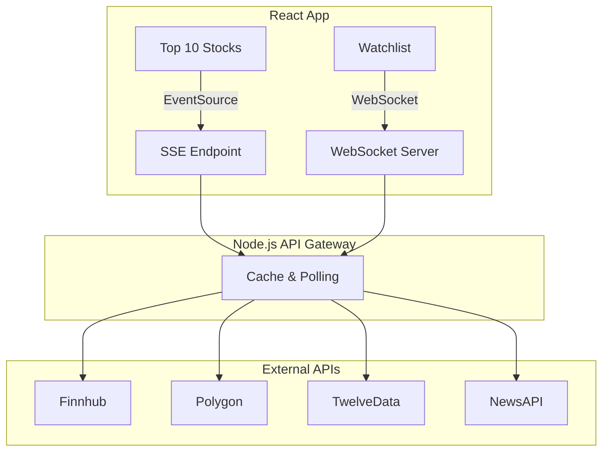

# Stock Tracker — Live Market Data App

A full-stack stock tracking application built as my Computer Science thesis project.

The application delivers live market data using **Server-Sent Events (SSE)** and **WebSockets** through a Node.js API gateway that caches stock quotes and minimizes unnecessary API requests.

---

## Overview

The goal of this project was to explore different approaches to delivering real-time financial data while building a scalable frontend and backend architecture.

Instead of connecting the frontend directly to multiple third-party APIs, a Node.js API gateway sits between the client and external services. The gateway manages caching, distributes live updates, and reduces redundant API requests.

---

## Features

| Area | Description |
|------|-------------|
| **Top 10 Stocks** | Live prices for major U.S. stocks delivered through Server-Sent Events. |
| **Market Status** | Displays whether the market is open or closed, including weekends, holidays, and trading hours. |
| **Stock Search** | Search stocks using the Finnhub API with debounced requests. |
| **Stock Details** | Live prices, daily changes, and TradingView charts. |
| **Watchlist** | Save up to three stocks with live updates through WebSockets. |
| **Price Alerts** | Create price alerts monitored every 30 seconds. |
| **Market News** | Displays the latest financial news. |
| **Automatic Reconnection** | WebSocket reconnects automatically after connection loss. |

---

## Technology Stack

### Frontend

- React 19
- Vite
- Tailwind CSS
- React Context API
- Chart.js
- Custom React Hooks

### Backend

- Node.js
- Express
- WebSockets (`ws`)
- Server-Sent Events (SSE)

### External APIs

- Finnhub
- Polygon.io
- Twelve Data
- NewsAPI

---

## System Architecture



---

## Real-Time Communication

The application uses two different real-time technologies because they solve different problems.

| Technology | Purpose |
|------------|---------|
| **Server-Sent Events (SSE)** | Broadcasts the same market data (Top 10 stocks and market status) to every connected user. |
| **WebSockets** | Streams personalized updates for each user's watchlist. |

The API gateway requests each stock quote only once and then distributes the data to connected clients. This reduces unnecessary requests while keeping the user interface responsive.

---

## Design Decisions

Several architectural decisions were made to improve performance, maintainability, and API efficiency.

- Built a Node.js API gateway to centralize communication with external services.
- Used Server-Sent Events for shared market data and WebSockets for user-specific updates.
- Cached stock quotes to reduce duplicate API requests.
- Stored watchlists and alerts in local storage so users keep their data between sessions.
- Reduced polling while the market is closed to avoid unnecessary requests.

---

## Working with Free API Plans

This project was developed using the free tiers of several market data providers.

Free plans typically enforce strict request limits, making efficient API usage an important design consideration rather than simply a cost-saving measure.

To work within these limits, the application:

- Caches frequently requested stock quotes.
- Deduplicates requests across connected clients.
- Fetches each symbol only once before distributing updates through SSE and WebSockets.
- Reduces polling when markets are closed.
- Uses a gateway instead of allowing every browser to call external APIs independently.

Although these optimizations were initially driven by free-tier limitations, they are also common techniques used in production systems to improve scalability and reduce external API traffic.

---

## Project Structure

```
stocks_tracker/
├── server/
│   ├── index.js
│   └── WEBSOCKET.md
├── src/
│   ├── components/
│   ├── hooks/
│   ├── contexts/
│   ├── config/
│   └── pages/
├── public/
└── .env.example
```

---

## WebSocket Protocol

### Client

```json
{
  "type": "subscribe",
  "symbols": [
    "AAPL",
    "MSFT"
  ]
}
```

### Server

```json
{
  "type": "prices",
  "quotes": [],
  "lastUpdatedAt": "..."
}
```

For the complete protocol, see `server/WEBSOCKET.md`.

---

## Challenges

Some of the challenges encountered during development included:

- Managing external API rate limits.
- Keeping multiple real-time data streams synchronized.
- Handling automatic reconnection after network interruptions.
- Preventing duplicate API requests from multiple users.
- Designing separate communication channels for broadcast and personalized data.

---

## Future Improvements

- User authentication
- Cloud-synchronized watchlists
- Portfolio tracking
- Historical performance analytics
- Docker deployment
- Automated testing
- CI/CD pipeline with GitHub Actions

---

## What I Learned

Building this project gave me practical experience with:

- Designing real-time web applications using Server-Sent Events and WebSockets.
- Building an API gateway to coordinate multiple external services.
- Working with API rate limits and caching strategies.
- Managing application state using React Context and custom hooks.
- Building resilient real-time communication with automatic reconnection.
- Designing systems that balance responsiveness with efficient resource usage.
