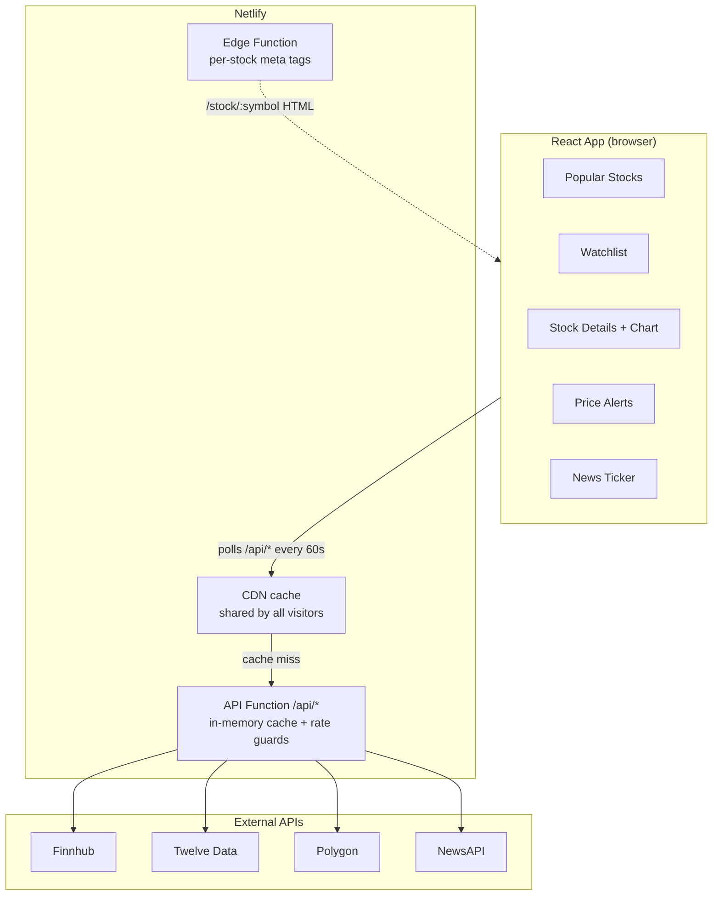

# Stock Tracker — Live Market Data App

A full-stack stock tracking application built as my Computer Science thesis project.

**Live demo:** [istocktracker.netlify.app](https://istocktracker.netlify.app)

The app shows live prices for popular US stocks, interactive candlestick charts, a personal watchlist, price alerts and market news. All market data flows through a serverless API gateway that keeps API keys private and caches aggressively so the app stays within the free tiers of four market data providers.

---

## Overview

The goal of this project was to explore different approaches to delivering near-real-time financial data while building a secure, low-cost frontend and backend architecture.

Instead of connecting the browser directly to third-party APIs, an API gateway sits between the client and the external services. The gateway hides the API keys, caches responses, and makes sure many users share the same upstream requests.

The project went through two architectures — a long-running Node.js server with Server-Sent Events and WebSockets, and then a serverless gateway on Netlify. The reasons for the change are described in [Architecture Evolution](#architecture-evolution).

---

## Features

| Area | Description |
|------|-------------|
| **Popular Stocks** | Live prices for 10 major US stocks with change and % change, refreshed every minute. |
| **Market Status** | Shows whether the US market is open, closed, on a weekend or on a holiday. |
| **Stock Search** | Search companies and tickers with debounced requests. |
| **Stock Details** | Company name, logo, industry, market cap, and the day's open/high/low/close. |
| **Interactive Charts** | Candlestick or line charts with volume and 1M / 3M / 6M / 1Y / 5Y ranges, built with TradingView's open-source Lightweight Charts. |
| **Watchlist** | Save up to five stocks; prices refresh every minute. |
| **Price Alerts** | Up to three alerts with browser notifications when a price crosses the target. |
| **Market News** | Scrolling ticker with the latest financial headlines. |
| **Link Previews** | Each stock page has its own title and description for search engines and social sharing. |

---

## Technology Stack

### Frontend

- React 19 with Vite
- Tailwind CSS 4
- React Context API and custom hooks
- Lightweight Charts (TradingView, Apache 2.0)

### Backend

- Netlify Functions (serverless API gateway)
- Netlify Edge Functions (per-stock SEO metadata)
- Netlify CDN caching

### External APIs

| API | Used for |
|-----|----------|
| Finnhub | Quotes, symbol search, company profiles |
| Twelve Data | Historical daily prices for charts |
| Polygon.io | Market holiday detection |
| NewsAPI | Market news headlines |

### Quality

- Vitest unit and integration tests
- ESLint
- Tests run automatically before every Netlify build

---

## System Architecture


```mermaid
flowchart TB
  subgraph Browser["React App (browser)"]
    Popular["Popular Stocks"]
    Watch["Watchlist"]
    Detail["Stock Details + Chart"]
    Alerts["Price Alerts"]
    News["News Ticker"]
  end

  subgraph Netlify["Netlify"]
    Edge["Edge Function<br/>per-stock meta tags"]
    CDN["CDN cache<br/>shared by all visitors"]
    Fn["API Function /api/*<br/>in-memory cache + rate guards"]
  end

  subgraph APIs["External APIs"]
    Finnhub
    TwelveData["Twelve Data"]
    Polygon
    NewsAPI
  end

  Browser -->|"polls /api/* every 60s"| CDN
  CDN -->|"cache miss"| Fn
  Edge -.->|"/stock/:symbol HTML"| Browser
  Fn --> Finnhub
  Fn --> TwelveData
  Fn --> Polygon
  Fn --> NewsAPI
```

### API routes

| Route | Returns | Source | Cached for |
|-------|---------|--------|-----------|
| `/api/snapshot` | Market status + popular stocks | Finnhub, Polygon | 1 min (open) / 10 min (closed) |
| `/api/quotes?symbols=` | Up to 5 quotes (watchlist, alerts) | Finnhub | 1 min |
| `/api/quote?symbol=` | Full quote for one stock | Finnhub | 30 s |
| `/api/search?q=` | Matching symbols | Finnhub | 1 hour |
| `/api/profile?symbol=` | Company name, logo, industry, market cap | Finnhub | 1 day |
| `/api/history?symbol=` | ~5 years of daily OHLCV bars | Twelve Data | 1 hour |
| `/api/news` | Latest headlines | NewsAPI | 2 hours |

---

## Architecture Evolution

### Version 1 — Node.js gateway with SSE and WebSockets

The first version used a long-running Express server:

| Technology | Purpose |
|------------|---------|
| **Server-Sent Events (SSE)** | Broadcast the same market data (top stocks and market status) to every connected user. |
| **WebSockets** | Stream personalised updates for each user's watchlist, with automatic reconnection. |

The server polled each quote once and pushed it to all connected clients, which kept upstream traffic low. The code is preserved in the Git history (see commit `b8cf4de`).

### Version 2 — Serverless gateway on Netlify (current)

When deploying, I moved to a serverless design:

- **Hosting:** serverless platforms like Netlify cannot keep SSE or WebSocket connections open, and an always-on server costs money or sleeps on free plans.
- **Security:** version 1 also called some APIs directly from the browser, which meant API keys were shipped inside the JavaScript bundle. In version 2 every request goes through the gateway, so keys never reach the browser.
- **Same efficiency, different mechanism:** instead of pushing one shared update to connected clients, the CDN caches each response so all visitors share one upstream request.

| | Version 1 (push) | Version 2 (poll + cache) |
|---|---|---|
| Update delay | Instant push | Up to ~60 seconds |
| Hosting | Always-on server | Serverless, free tier |
| Upstream calls | One per poll cycle | One per cache period |
| API keys | Partly exposed in browser | Server-side only |
| Scaling | Limited by open connections | Handled by the CDN |

For end-of-day and minute-level stock data, a delay of up to a minute was an acceptable trade for free hosting and better security.

---

## Working with Free API Plans

This project uses only free API plans, so staying under request limits was a core design constraint.

| API | Free limit | How the app stays under it |
|-----|-----------|----------------------------|
| **Finnhub** | 60 calls/min | Responses cached on the CDN and in memory; popular stocks, watchlist, alerts and stock pages share the same cached quotes. |
| **Twelve Data** | 8 calls/min, 800/day | Only used for charts. One call returns 5 years of data, so every chart range is a slice of it. Cached for an hour in the browser, on the CDN and in memory. A guard stops at 7 calls/min and serves older data instead. |
| **Polygon** | 5 calls/min | Only called during trading hours, at most once every 5 minutes. |
| **NewsAPI** | 100 calls/day | Cached for 2 hours (about 12 calls/day). |

Other measures:

- Price alerts only check prices while the market is open.
- The CDN cache key ignores unknown query parameters, so `?x=123` cannot be used to bypass the cache and drain quotas.
- Each visitor is limited to 60 API requests per minute.

---

## Security

- API keys are stored as Netlify environment variables and only used server-side.
- Strict Content-Security-Policy, `X-Frame-Options`, `X-Content-Type-Options`, `Referrer-Policy` and `Permissions-Policy` headers.
- Input validation on every API parameter (ticker format, lengths).
- Only `http(s)` links from external data are rendered.
- Generic error messages to the client; details are logged server-side.
- Self-hosted fonts (no requests to Google Fonts).

---

## Project Structure

```
stocks_tracker/
├── netlify/
│   ├── functions/api.mjs       # API gateway (all /api/* routes)
│   ├── edge-functions/         # per-stock SEO meta tags
│   └── lib/utils.mjs           # pure helpers (tested)
├── src/
│   ├── components/             # UI components (StockChart, TopTen, Watchlist, …)
│   ├── contexts/               # prices and price-alert state
│   ├── hooks/                  # data-fetching and storage hooks
│   ├── config/api.js           # API client
│   └── App.jsx                 # routing and page layout
├── tests/                      # Vitest tests
├── public/                     # icons, robots.txt, sitemap.xml, share image
├── netlify.toml                # build, redirects, security headers
└── .env.example
```

---

## Running Locally

Requirements: Node.js 20+.

```bash
npm install
cp .env.example .env   # then add your API keys
npm run dev            # http://localhost:5173
```

`npm run dev` runs the same API function locally through a Vite plugin, so no extra server is needed.

| Command | What it does |
|---------|--------------|
| `npm run dev` | Start the app with the local API |
| `npm test` | Run the test suite |
| `npm run lint` | Run ESLint |
| `npm run build` | Build for production |

### Environment variables

| Name | Get a free key at |
|------|-------------------|
| `FINNHUB_API_KEY` | [finnhub.io](https://finnhub.io/) |
| `TWELVE_DATA_KEY` | [twelvedata.com](https://twelvedata.com/) |
| `POLYGON_API_KEY` | [polygon.io](https://polygon.io/) |
| `NEWSAPI_KEY` | [newsapi.org](https://newsapi.org/) |

## Deployment

The site is hosted on Netlify. Pushing to `main` builds and deploys automatically once the repository is linked in Netlify. The build runs the tests first, so a failing test stops the deploy. API keys are set under *Site configuration → Environment variables*.

---

## Known Limitations

- **Price alerts only run while the site is open in a browser tab.** True background alerts would need user accounts and a server-side scheduler.
- **Prices update about once a minute**, not tick by tick.
- **Watchlists and alerts are stored in the browser** (localStorage), so they don't sync between devices.
- **Charts and company details cover mainly US stocks**, due to free-plan coverage.

---

## Challenges

- Managing the rate limits of four different free APIs at the same time.
- Replacing push-based real-time updates with a serverless design without increasing API usage.
- Keeping API keys out of the browser.
- Preventing one user (or a script) from exhausting the shared API quotas.
- Making a client-rendered React app work well for search engines and link previews.

---

## Future Improvements

- User accounts with cloud-synchronised watchlists and alerts
- Server-side scheduled price alerts (push notifications)
- Portfolio tracking
- Real-time updates via a managed WebSocket service for market hours
- Custom domain

---

## What I Learned

Building this project gave me practical experience with:

- Designing real-time web applications using Server-Sent Events and WebSockets, and understanding their hosting trade-offs.
- Moving an architecture from a long-running server to serverless functions and CDN caching.
- Building an API gateway to coordinate multiple external services while keeping credentials secure.
- Working with strict API rate limits through layered caching and request guards.
- Web security basics: Content-Security-Policy, security headers and input validation.
- Technical SEO for single-page applications (canonical URLs, edge-rendered meta tags, sitemaps).
- Writing automated tests that protect critical behaviour like quota limits.
